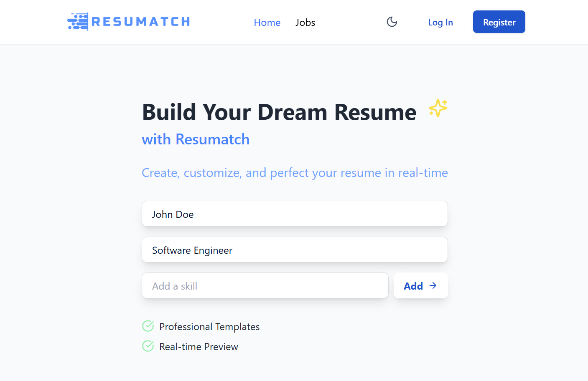
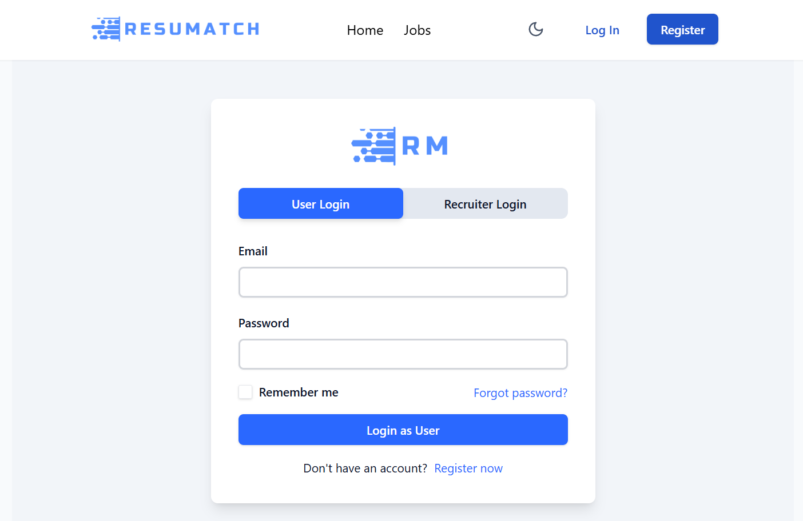
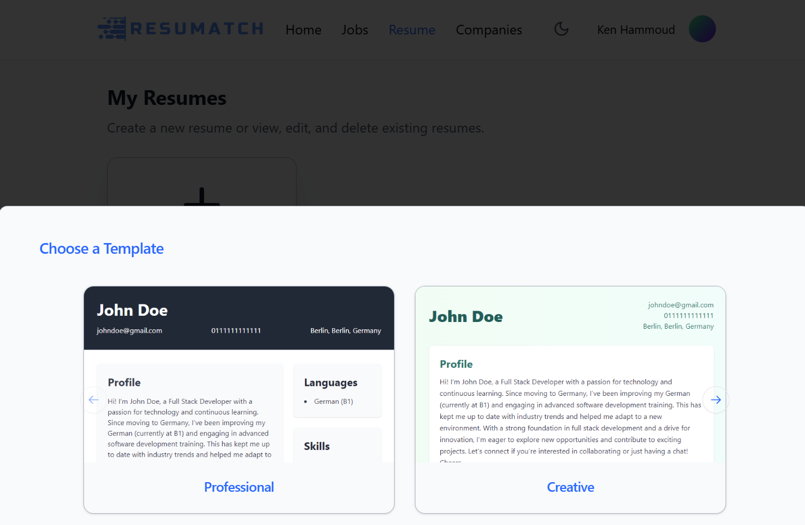
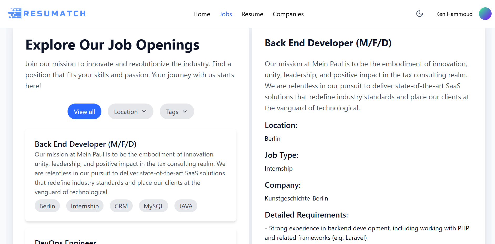
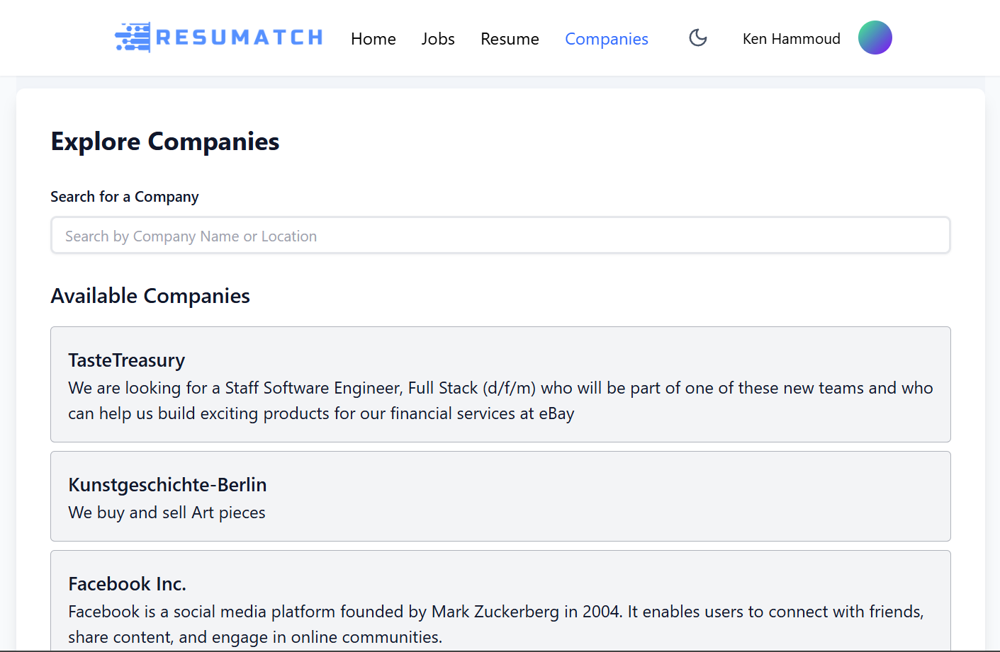

# RESUMATCH-FRONT

**ResuMatch Frontend** is the React-based client application for the ResuMatch platform. Designed to modernize your resume and streamline the job application process, this frontend provides an intuitive user interface for creating or updating resumes, browsing job listings, and interacting with recruiters—all within the ResuMatch ecosystem.

This frontend application communicates with our dedicated backend API (available at [[Backend Repository Link](https://github.com/IbrahimHam/resumatch-back)]) that handles authentication, resume management, job posting, and more.

---

## Table of Contents

- [Features](#features)
- [Tech Stack](#tech-stack)
- [Screenshots](#screenshots)
- [Getting Started](#getting-started)
  - [Prerequisites](#prerequisites)
  - [Installation](#installation)
  - [Environment Variables](#environment-variables)
- [Project Structure](#project-structure)
- [Available Scripts](#available-scripts)
- [Contributing](#contributing)

---

## Features

- **User Authentication:**  
  - Login and registration pages with role-based access (job seeker or recruiter).
  - Secure authentication implemented using React Context and JWT integration.

- **Resume Building & Management:**  
  - Create new resumes from scratch using modern, professional templates.
  - Upload and edit existing resumes, with data automatically integrated from the backend.

- **Job & Company Interaction:**  
  - Browse job listings and apply directly through the platform.
  - Recruiters can create and manage companies and job postings.
  - Protected routes ensure that only authorized users access specific sections.

- **Theming & UI Enhancements:**  
  - Built-in dark/light mode toggling for a seamless user experience.
  - Responsive and modern UI components styled with Tailwind CSS and enhanced by Radix UI.

---

## Tech Stack

- **Framework:** React
- **Build Tool:** Vite
- **Styling:** Tailwind CSS, PostCSS, ShadCN UI
- **Routing:** React Router DOM
- **State Management:** React Context API
- **HTTP Client:** Axios
- **Utilities:**  
  - clsx & tailwind-merge for dynamic class handling
  - UI libraries: Radix UI, Framer Motion

---

## Screenshots

### Home Page



### Login Page



### Resume Builder



### Job Listings




### Available Listings




---

## Getting Started

### Prerequisites

- **Node.js** (v14 or higher)
- **npm** (or yarn)

### Installation

1. **Clone the repository:**
   ```bash
   git clone git@github.com:IbrahimHam/resumatch-front.git
   cd resumatch-front
2. **Install dependencies:**
    ```bash
    npm install
3. **Configure Environment Variables:** 
Create a .env file in the root directory with the following content (adjust the API URL if needed):
    ```bash
    VITE_API_URL=http://localhost:3000/api
    VITE_BASE_URL=http://localhost:3000
4. **Start the Development Server:**
    ```bash
    npm run dev
The application will be available at http://localhost:3000.

---

## Project Structure
The src directory contains the core application code:

    ```bash
    resumatch-front/
    ├── public/                       # Static assets and HTML templates
    ├── src/
    │   ├── components/               # Reusable UI components (e.g., Navbar, Footer, Error Pages)
    │   ├── context/                  # React context providers
    │   │   ├── AuthContext.jsx      # Authentication context and provider
    │   │   └── ThemeContext.jsx     # Theme (light/dark) context and provider
    │   ├── lib/                      # Utility functions (e.g., class name merging in utils.js)
    │   ├── pages/                    # Page components corresponding to different routes:
    │   │   ├── Home.jsx
    │   │   ├── LoginPage.jsx
    │   │   ├── RegisterPage.jsx
    │   │   ├── CreateCompanyPage.jsx
    │   │   ├── CreateJobPage.jsx
    │   │   ├── ResumePage.jsx
    │   │   ├── SettingsPage.jsx
    │   │   ├── JobListPage.jsx
    │   │   ├── ResumeLibraryPage.jsx
    │   │   ├── CompanyPage.jsx
    │   │   ├── CompaniesPage.jsx
    │   │   ├── ApplyPage.jsx
    │   │   └── JoinOrCreateCompanyPage.jsx
    │   ├── routes/                   # Routing configuration
    │   │   ├── AppRoutes.jsx         # Main routing with protected route logic
    │   │   └── RoutesConfig.jsx      # Route definitions (paths, components, access control)
    │   ├── App.jsx                   # Main application component (layout with Navbar & Footer)
    │   ├── main.jsx                  # Entry point for rendering the React app
    │   └── index.css                 # Global styles and Tailwind CSS setup
    ├── package.json                  # Project metadata and dependencies
    ├── vite.config.js                # Vite configuration with alias setup
    ├── jsconfig.json                 # JS configuration for path aliasing
    ├── components.json             # ShadCN UI configuration for component styling
    └── vercel.json                   # Deployment configuration for Vercel

--- 

## Available Scripts
- npm run dev
Runs the application in development mode with hot module replacement.

- npm run build
Builds the application for production.

- npm run preview
Previews the production build locally.

- npm run lint
Runs ESLint to check for code quality issues.

--- 

## Contributing
Contributions are welcome! To contribute:

1. Fork the repository.
2. Create a feature branch (e.g., git checkout -b feature/YourFeature).
3. Commit your changes with clear commit messages.
4. Push your branch and open a pull request.
